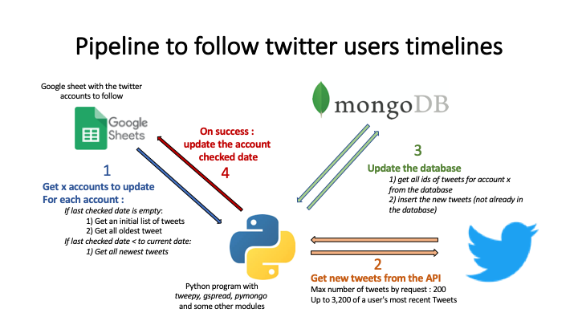

# Pipeline to follow twitter users timelines

## To be updated

- **[getUsersTweetsTimeline.ipynb](getUsersTweetsTimeline.ipynb)** : Jupyter NoteBook version
- **[getUsersTweetsTimeline.py](getUsersTweetsTimeline.py)** : Python script version

